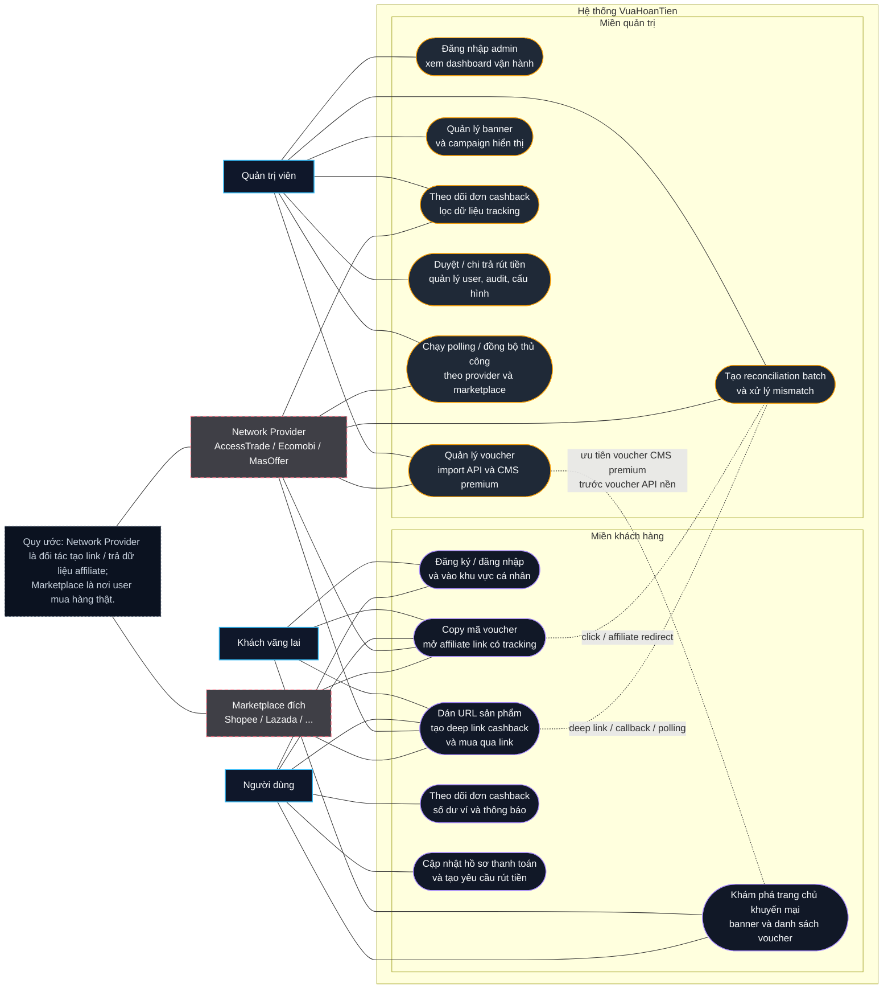

# VuaHoanTien — 02. Danh mục use case đầy đủ

**Phiên bản:** 1.2  
**Cập nhật lần cuối:** 2026-03-30  
**Phạm vi:** Toàn bộ use case cho client và admin của VuaHoanTien  
**Tham chiếu thuật ngữ:** `docs/00-glossary.md`

## Mục lục

- [1. Cấu trúc tài liệu](#1-cấu-trúc-tài-liệu)
- [2. Sơ đồ use case tổng quát](#2-sơ-đồ-use-case-tổng-quát)
- [3. Use case phía khách hàng](#3-use-case-phía-khách-hàng)
- [4. Use case phía quản trị](#4-use-case-phía-quản-trị)
- [5. Ma trận bao phủ use case](#5-ma-trận-bao-phủ-use-case)

## 1. Cấu trúc tài liệu

Mỗi use case trong tài liệu **VuaHoanTien** đều có:

- Mục tiêu
- Tác nhân
- Preconditions
- Main Flow
- Alternate Flows
- Postconditions

Chuẩn hóa bổ sung ở phiên bản này:

- Phân biệt rõ **network provider** (AccessTrade / Ecomobi / MasOffer) với **marketplace đích** (ví dụ Shopee / Lazada).
- Phân biệt rõ `voucher_source` giữa **API** và **CMS premium** để tránh nhập nhằng ở hiển thị, tracking và reconciliation.
- Chuỗi tracking chuẩn đi theo thứ tự: `tracking_session` → `voucher_click` → `deep_link_request` → `outbound redirect` → `affiliate callback/polling` → `reconciliation`.

## 2. Sơ đồ use case tổng quát

Sơ đồ dưới đây gom nhóm các use case theo **miền khách hàng** và **miền quản trị** để dễ nhìn ở mức business overview, trong khi vẫn giữ liên hệ rõ với các actor và hệ thống ngoài.

**Chú thích nhanh:**

- **Miền khách hàng** bao phủ UC-C01 → UC-C12, được gom thành 6 nhóm thao tác chính để sơ đồ dễ đọc ở mức tổng quát.
- **Miền quản trị** bao phủ UC-A01 → UC-A14, được gom thành 7 nhóm vận hành cốt lõi.
- Các đường nét đứt thể hiện những chuỗi dữ liệu quan trọng phục vụ đối soát: `click` → `deep link` → `callback/polling` → `reconciliation`.
- Sơ đồ cố ý tách riêng **network provider** và **marketplace đích** để bám đúng chuẩn mô hình hóa của hệ thống.

## 3. Use case phía khách hàng

### Ghi chú về nguồn voucher từ API (AccessTrade / Ecomobi / MasOffer)

- **Bối cảnh:** Hệ thống tích hợp các network provider như AccessTrade, Ecomobi, MasOffer để kéo về lượng lớn mã giảm giá cơ bản và tạo deep link/affiliate redirect theo adapter tương ứng.
- **Cái "ngon":** Số lượng cực nhiều, cập nhật tự động liên tục, tỷ lệ mã sống cao; bao gồm mã Freeship, mã ngành hàng, mã hoàn xu cơ bản — không cần cào (crawl) tay.
- **Cái "không ngon":** Đây là API đại trà cho hàng ngàn Publisher nên không có mã "độc quyền" như flash sale ẩn, mã KOL riêng, hoặc mã lỗi giá.
- **Giải pháp VuaHoanTien:** Dùng API để lót nền hàng loạt (voucher "công nghiệp"); những mã cực sốc, độc quyền, hoặc vị trí Banner Premium sẽ được Admin nhập tay qua CMS ở backend .NET và đẩy lên vị trí premium.
- **Quy tắc mô hình hóa:** `network_provider` là đối tác tạo link / trả dữ liệu affiliate; `marketplace` là nơi người dùng mua thật (ví dụ Shopee, Lazada). Hai khái niệm này không được dùng lẫn nhau trong các tài liệu còn lại.

Sự phối hợp giữa 1) ingest tự động từ network API và 2) CMS thủ công của Admin tạo ra giao diện "Voucher đỉnh" cho client.

### UC-C01 — Đăng ký tài khoản bằng email

- **Mục tiêu:** Tạo tài khoản để người dùng theo dõi cashback và ví.
- **Tác nhân:** Khách vãng lai.
- **Preconditions:** Email chưa tồn tại trong hệ thống.
- **Main Flow:** Người dùng nhập email, mật khẩu, xác nhận điều khoản; hệ thống tạo user; gửi email chào mừng; đăng nhập phiên đầu.
- **Alternate Flows:** Email đã tồn tại; mật khẩu yếu; email gửi thất bại nhưng tài khoản đã tạo.
- **Postconditions:** User có hồ sơ cơ bản và phiên đăng nhập hợp lệ.

### UC-C02 — Đăng nhập bằng email và mật khẩu

- **Mục tiêu:** Truy cập khu vực cá nhân.
- **Tác nhân:** Người dùng.
- **Preconditions:** Tài khoản tồn tại và chưa bị khóa.
- **Main Flow:** Người dùng nhập thông tin; BFF xác thực; hệ thống đặt cookie phiên; điều hướng về dashboard cá nhân.
- **Alternate Flows:** Sai mật khẩu; tài khoản bị khóa; vượt giới hạn thử đăng nhập.
- **Postconditions:** Phiên người dùng được tạo và ghi audit bảo mật.

### UC-C03 — Xem trang chủ khuyến mại

- **Mục tiêu:** Khám phá banner, voucher hot và lợi ích cashback.
- **Tác nhân:** Khách vãng lai, người dùng.
- **Preconditions:** Banner và nội dung đã được publish.
- **Main Flow:** Hệ thống tải hero banner, bento promo cards, voucher nổi bật, ô nhập link sản phẩm.
- **Alternate Flows:** Không có campaign đang chạy; một số banner hết hạn bị ẩn.
- **Postconditions:** Lượt xem được ghi nhận cho analytics nội bộ.

### UC-C04 — Duyệt và lọc danh sách voucher

- **Mục tiêu:** Tìm voucher phù hợp theo sàn, danh mục và mức giảm.
- **Tác nhân:** Khách vãng lai, người dùng.
- **Preconditions:** Hệ thống có voucher active.
- **Main Flow:** User mở trang voucher; áp dụng filter theo marketplace, danh mục, mức giảm hoặc campaign; hệ thống trả danh sách theo trạng thái, thời gian hiệu lực và thứ tự ưu tiên premium trước API nền.
- **Alternate Flows:** Không có kết quả; filter kết hợp quá hẹp.
- **Postconditions:** Lịch sử filter được lưu cục bộ để cải thiện trải nghiệm quay lại.

### UC-C05 — Copy mã giảm giá và mở link affiliate

- **Mục tiêu:** Giúp người dùng lấy mã nhanh và gắn tracking cho commission.
- **Tác nhân:** Khách vãng lai, người dùng.
- **Preconditions:** Voucher đang active và có link đích hợp lệ.
- **Main Flow:** User bấm Copy mã; hệ thống ghi voucher click; copy mã vào clipboard; mở tab mới tới link affiliate.
- **Alternate Flows:** Clipboard bị chặn; popup bị trình duyệt chặn; link đích tạm lỗi.
- **Postconditions:** Click event được lưu và tracking session được tạo.

	- **Ghi chú API vs CMS:** Khi hiển thị voucher, hệ thống ưu tiên các voucher do Admin đẩy (premium). Nếu không có hoặc không cùng campaign, hiển thị các mã cơ bản lấy từ API (AccessTrade / Ecomobi / MasOffer).
	- **Tracking & Flow chuẩn:** Khi user bấm Copy hoặc Mua ngay: tạo một `tracking session` (session id), ghi `click_id`, `voucher_source` (API | CMS), `voucher_id`, `user_id` (nếu có), `network_provider`, `marketplace` và timestamp; gọi endpoint tạo deep link/affiliate redirect; lưu payload outbound (affiliate URL + headers) để phục vụ reconciliation.

### UC-C06 — Dán URL sản phẩm để tạo deep link cashback

- **Mục tiêu:** Biến link sản phẩm gốc thành link mua có tracking hoàn tiền.
- **Tác nhân:** Khách vãng lai, người dùng.
- **Preconditions:** URL thuộc marketplace whitelist (ví dụ Shopee hoặc Lazada) và hệ thống có ít nhất một network provider đang hoạt động cho marketplace tương ứng.
- **Main Flow:** User dán URL; hệ thống validate domain và marketplace; chọn provider phù hợp; gọi adapter tạo deep link; trả card kết quả với CTA Mua ngay.
- **Alternate Flows:** Domain không hợp lệ; sản phẩm không hỗ trợ affiliate; network timeout.
- **Postconditions:** Deep link request và tracking session được lưu.

	- **Tracking & Flow chuẩn:** Khi tạo deep link: tạo `deep_link_request` record chứa `request_id`, `tracking_session_id`, `click_id` (nếu khởi phát từ voucher flow), `original_url`, `affiliate_url`, `network_provider` (AccessTrade|Ecomobi|MasOffer), `marketplace_code`, và trạng thái (pending/ok/failed). Tất cả event này phải liên kết với `click_id` hoặc correlation key để dễ đối soát sau này.

### UC-C07 — Mua hàng qua deep link

- **Mục tiêu:** Điều hướng người dùng sang app hoặc web đích với tracking còn nguyên.
- **Tác nhân:** Khách vãng lai, người dùng.
- **Preconditions:** Deep link đã tạo thành công.
- **Main Flow:** User bấm Mua ngay; hệ thống mở app đích; nếu không mở được thì fallback sang mobile web.
- **Alternate Flows:** App không cài; hệ điều hành chặn chuyển app; link hết hạn ngắn hạn.
- **Postconditions:** Sự kiện click outbound được ghi lại.

	- **Tracking & Flow chuẩn:** Khi mở outbound: cập nhật `click` record với `outbound_time`, `platform` (android/ios/web), `redirect_status` (success|fallback|blocked). Gắn `affiliate_click_id` nếu provider trả về. Những trường này phải được thu thập để phục vụ UC-A06 (reconciliation).

### UC-C08 — Xem lịch sử đơn cashback

- **Mục tiêu:** Theo dõi vòng đời đơn hàng đã mua qua VuaHoanTien.
- **Tác nhân:** Người dùng.
- **Preconditions:** User đã đăng nhập.
- **Main Flow:** Hệ thống trả danh sách order theo thời gian; user lọc theo trạng thái; mở chi tiết đơn để xem timeline.
- **Alternate Flows:** Chưa có đơn; có đơn mismatch tạm thời chưa hiển thị hoàn chỉnh.
- **Postconditions:** User hiểu được vì sao đơn đang pending hay approved.

### UC-C09 — Xem số dư ví

- **Mục tiêu:** Nắm số dư chờ duyệt, khả dụng và đang rút.
- **Tác nhân:** Người dùng.
- **Preconditions:** User đã đăng nhập và có wallet account.
- **Main Flow:** Hệ thống tổng hợp số dư từ ledger; hiển thị ba nhóm số dư chính; kèm lịch sử biến động gần đây.
- **Alternate Flows:** Chưa có giao dịch; đang bảo trì realtime nhưng vẫn có snapshot.
- **Postconditions:** User biết ngay khả năng rút tiền của mình.

### UC-C10 — Tạo yêu cầu rút tiền

- **Mục tiêu:** Chuyển số dư khả dụng ra tài khoản nhận tiền.
- **Tác nhân:** Người dùng.
- **Preconditions:** Số dư khả dụng đủ tối thiểu; hồ sơ nhận tiền hợp lệ.
- **Main Flow:** User chọn phương thức; nhập thông tin; xác nhận; hệ thống giữ chỗ số dư và tạo withdrawal request.
- **Alternate Flows:** Số dư không đủ; hồ sơ thanh toán thiếu; user vượt ngưỡng risk.
- **Postconditions:** Yêu cầu rút ở trạng thái chờ duyệt.

### UC-C11 — Cập nhật hồ sơ thanh toán

- **Mục tiêu:** Lưu thông tin ngân hàng hoặc ví điện tử nhận tiền.
- **Tác nhân:** Người dùng.
- **Preconditions:** User đã đăng nhập.
- **Main Flow:** User mở cài đặt thanh toán; nhập thông tin; hệ thống kiểm tra định dạng; lưu phiên bản mới.
- **Alternate Flows:** Số tài khoản sai định dạng; tên người nhận trống.
- **Postconditions:** Hồ sơ thanh toán sẵn sàng cho yêu cầu rút tiền sau này.

### UC-C12 — Xem thông báo trạng thái đơn và rút tiền

- **Mục tiêu:** Nhận cập nhật khi đơn được duyệt hoặc yêu cầu rút thay đổi.
- **Tác nhân:** Người dùng.
- **Preconditions:** Có notification event liên quan đến user.
- **Main Flow:** User mở trung tâm thông báo; xem item mới; đánh dấu đã đọc; mở sâu vào order hoặc withdrawal.
- **Alternate Flows:** Thông báo đã hết hiệu lực liên kết sâu; dịch vụ realtime tạm gián đoạn.
- **Postconditions:** Người dùng nắm được thay đổi quan trọng mà không cần tự kiểm tra thủ công.

## 4. Use case phía quản trị

### UC-A01 — Đăng nhập khu vực admin

- **Mục tiêu:** Truy cập Admin Console an toàn.
- **Tác nhân:** Quản trị viên.
- **Preconditions:** Tài khoản có quyền admin.
- **Main Flow:** Admin đăng nhập; hệ thống kiểm tra quyền; mở dashboard quản trị.
- **Alternate Flows:** Không có quyền admin; mật khẩu sai; IP bị chặn tạm thời.
- **Postconditions:** Admin session được ghi audit log.

### UC-A02 — Xem dashboard vận hành

- **Mục tiêu:** Theo dõi sức khỏe kinh doanh và xử lý hằng ngày.
- **Tác nhân:** Quản trị viên.
- **Preconditions:** Có dữ liệu chỉ số.
- **Main Flow:** Hệ thống hiển thị GMV tracked, commission, cashback pending, approved, mismatch, withdrawal queue.
- **Alternate Flows:** Một widget tạm thiếu dữ liệu; bộ lọc ngày gây trống cục bộ.
- **Postconditions:** Admin xác định được khu vực cần xử lý ưu tiên.

### UC-A03 — Tạo và chỉnh sửa voucher

- **Mục tiêu:** Vận hành kho voucher hấp dẫn và chính xác.
- **Tác nhân:** Quản trị viên.
- **Preconditions:** Có merchant, category và đường dẫn đích hợp lệ.
- **Main Flow:** Admin nhập mã, tiêu đề, mô tả, thời gian hiệu lực, network; lưu draft hoặc publish.
- **Alternate Flows:** Trùng mã; link đích sai domain; thời gian bắt đầu sau thời gian kết thúc.
- **Postconditions:** Voucher được lưu và có trạng thái rõ ràng.

	- **Mở rộng (API + CMS):** Hệ thống hỗ trợ hai nguồn voucher:
		- **Ingest từ API:** Admin cấu hình kết nối đến AccessTrade / Ecomobi / MasOffer; hệ thống có thể import batch hoặc chạy sync định kỳ để lấy mã "cơ bản". Quy trình import bao gồm mapping trường, de-duplication theo hash (merchant+code+valid_from), gắn `network_provider`, và gắn nguồn `voucher_source=API`.
		- **CMS thủ công (.NET):** Admin có thể tạo hoặc nâng cấp voucher thủ công (premium) qua backend .NET CMS, gán vị trí hiển thị (ví dụ Banner Premium). Những voucher này được gắn `voucher_source=CMS`, có thể override mã API cùng merchant/campaign, và được ưu tiên hiển thị.

	- **Main Flow (mở rộng):** Admin có thể chọn "Import từ network API" để tải batch; hệ thống hiển thị preview, cho phép chỉnh sửa trước khi publish; admin cũng có thể tạo voucher thủ công, gắn promotion slot và promote lên Banner Premium.

	- **Postconditions (mở rộng):** Mỗi voucher có metadata `voucher_source` (API|CMS), `network_provider`, `import_batch_id` (nếu có), và `promotion_slot` (nếu premium). Điều này hỗ trợ ưu tiên hiển thị và đối soát sau này.

### UC-A04 — Quản lý banner quảng cáo

- **Mục tiêu:** Điều phối các vị trí quảng cáo và chiến dịch hiển thị.
- **Tác nhân:** Quản trị viên.
- **Preconditions:** Có slot banner đã định nghĩa.
- **Main Flow:** Admin tạo banner, gắn CTA, lịch phát, hình ảnh, màu nền; publish đúng vị trí.
- **Alternate Flows:** Banner chồng lịch; thiếu CTA; hình ảnh không đạt chuẩn tỷ lệ.
- **Postconditions:** Banner sẵn sàng hiển thị trên trang client.

### UC-A05 — Xem và lọc đơn cashback

- **Mục tiêu:** Theo dõi toàn bộ vòng đời đơn hàng liên kết.
- **Tác nhân:** Quản trị viên.
- **Preconditions:** Có cashback orders trong hệ thống.
- **Main Flow:** Admin lọc theo network provider, marketplace, voucher source, trạng thái, user, date range; mở chi tiết đơn; xem raw tracking data.
- **Alternate Flows:** Order bị mismatch; dữ liệu network chưa đồng bộ xong.
- **Postconditions:** Admin có đủ ngữ cảnh để ra quyết định xử lý.

### UC-A06 — Xử lý mismatch đối soát

- **Mục tiêu:** Giải quyết đơn không khớp giữa dữ liệu nội bộ và network.
- **Tác nhân:** Quản trị viên.
- **Preconditions:** Đã có reconciliation batch và mismatch item.
- **Main Flow:** Admin mở batch; chọn dòng sai lệch; xem payload gốc, click history, deep link request; ghi chú và áp dụng hành động xử lý.
- **Alternate Flows:** Thiếu dữ liệu chứng minh; cần chờ batch mới từ provider hoặc callback/polling tiếp theo.
- **Postconditions:** Mismatch được đóng hoặc escalated với lý do rõ ràng.

	- **Mở rộng (thông tin tracking):** Mỗi item mismatch phải hiển thị rõ `voucher_source` (API|CMS), `click_id`, `tracking_session_id`, `deep_link_request_id`, và `affiliate_click_id` (nếu network trả về). Admin có thể lọc theo `voucher_source` để ưu tiên xử lý các voucher CMS (premium) hoặc batch API lớn.

	- **Main Flow (mở rộng):** Khi điều tra, admin có thể mở chuỗi sự kiện liên quan (click → deep_link_request → affiliate callback) và export payload cho network support. Hệ thống lưu annotation và hành động (close/escalate/adjust wallet) kèm user audit.

### UC-A07 — Duyệt hoặc từ chối yêu cầu rút tiền

- **Mục tiêu:** Kiểm soát dòng tiền ra khỏi hệ thống.
- **Tác nhân:** Quản trị viên.
- **Preconditions:** Có withdrawal request trạng thái chờ duyệt.
- **Main Flow:** Admin xem hồ sơ user, lịch sử order, risk flags; chọn approve hoặc reject; hệ thống cập nhật trạng thái tương ứng.
- **Alternate Flows:** User đang bị review; thông tin nhận tiền vừa thay đổi gần đây; số dư giữ chỗ không còn hợp lệ do race condition được hệ thống chặn trước.
- **Postconditions:** Yêu cầu rút đi vào luồng giải ngân hoặc hoàn chỗ giữ tiền.

### UC-A08 — Xác nhận đã chi trả

- **Mục tiêu:** Hoàn tất vòng đời payout.
- **Tác nhân:** Quản trị viên.
- **Preconditions:** Withdrawal đã được approve.
- **Main Flow:** Admin nhập mã giao dịch chi trả; đánh dấu paid; hệ thống tạo bút toán debit hoàn tất và gửi thông báo cho user.
- **Alternate Flows:** Giao dịch thất bại; phải retry; thông tin mã giao dịch trùng.
- **Postconditions:** Tiền được phản ánh đúng ở ví và lịch sử rút tiền.

### UC-A09 — Quản lý người dùng

- **Mục tiêu:** Tra cứu và xử lý vấn đề tài khoản.
- **Tác nhân:** Quản trị viên.
- **Preconditions:** User đã tồn tại trong hệ thống.
- **Main Flow:** Admin tìm user; xem hồ sơ, lịch sử đơn, wallet summary, withdrawal history; khóa hoặc mở khóa nếu cần.
- **Alternate Flows:** User có tranh chấp đang mở; tài khoản guest chưa hoàn tất đăng ký.
- **Postconditions:** Trạng thái user được cập nhật có kiểm soát và ghi audit.
<!-- 
### UC-A10 — Chạy polling hoặc đồng bộ thủ công

- **Mục tiêu:** Khởi chạy đồng bộ dữ liệu khi cần xử lý khẩn.
- **Tác nhân:** Quản trị viên.
- **Preconditions:** Network account hoạt động.
- **Main Flow:** Admin chọn network provider/account, marketplace (nếu cần), nhập thời gian; kích hoạt job sync hoặc polling; theo dõi kết quả import, duplicate và mismatch.
- **Alternate Flows:** Job đang chạy; khoảng thời gian không hợp lệ; provider rate limit; provider account tạm ngưng.
- **Postconditions:** Batch đồng bộ mới được ghi lại cho vận hành kèm metadata provider, marketplace và trạng thái xử lý. -->

### UC-A11 — Cấu hình tỷ lệ chia cashback

- **Mục tiêu:** Quản lý phần trăm chia giữa nền tảng và người dùng.
- **Tác nhân:** Quản trị viên.
- **Preconditions:** Admin có quyền cấu hình.
- **Main Flow:** Admin cập nhật tỷ lệ mặc định hoặc theo campaign; hệ thống áp dụng cho đơn mới đủ điều kiện.
- **Alternate Flows:** Tỷ lệ vượt giới hạn; xung đột với campaign đang hoạt động.
- **Postconditions:** Chính sách payout mới được lưu và có hiệu lực rõ ràng.

### UC-A12 — Xem nhật ký kiểm toán

- **Mục tiêu:** Điều tra thay đổi quan trọng và phục vụ kiểm soát nội bộ.
- **Tác nhân:** Quản trị viên.
- **Preconditions:** Hệ thống đã ghi audit log.
- **Main Flow:** Admin lọc theo actor, module, ngày; mở chi tiết action; xem trước và sau thay đổi.
- **Alternate Flows:** Một số action chỉ có metadata mà không có before snapshot đầy đủ.
- **Postconditions:** Admin có bằng chứng thao tác rõ ràng.
<!-- 
### UC-A13 — Tạo reconciliation batch

- **Mục tiêu:** Khởi tạo phiên đối soát định kỳ hoặc thủ công.
- **Tác nhân:** Quản trị viên.
- **Preconditions:** Có dữ liệu network và dữ liệu nội bộ trong khoảng thời gian chọn.
- **Main Flow:** Admin tạo batch; hệ thống nạp dữ liệu; chạy so khớp; hiển thị summary matched và mismatch.
- **Alternate Flows:** Batch trùng kỳ; network trả lỗi một phần.
- **Postconditions:** Một reconciliation batch mới sẵn sàng cho điều tra.

### UC-A14 — Xử lý hoàn tiền một phần hoặc đảo chiều

- **Mục tiêu:** Đảm bảo ví phản ánh đúng khi network điều chỉnh đơn đã ghi nhận.
- **Tác nhân:** Quản trị viên.
- **Preconditions:** Order đã approved hoặc đã tác động đến ví.
- **Main Flow:** Admin mở order; xem adjustment từ network; xác nhận hoặc để hệ thống tạo bút toán đảo chiều; gửi thông báo user.
- **Alternate Flows:** Điều chỉnh nhỏ hơn số cashback đã khóa; order đang gắn với withdrawal pending.
- **Postconditions:** Wallet và lịch sử đơn được cân bằng lại đúng chuẩn ledger. -->

## 5. Ma trận bao phủ use case

| Nhóm | Số lượng | Phạm vi |
|---|---|---|
| Client | 12 | Đăng ký, đăng nhập, voucher, cashback, ví, rút tiền, thông báo |
| Admin | 14 | Dashboard, voucher, banner, order, withdrawal, reconciliation, audit |
| Tổng | 26 | Bao phủ đầy đủ client đến admin cho VuaHoanTien |

Tài liệu này là trục nghiệp vụ để các tài liệu wireframe, database schema và API specification tham chiếu thống nhất trong toàn bộ hệ thống **VuaHoanTien**.
